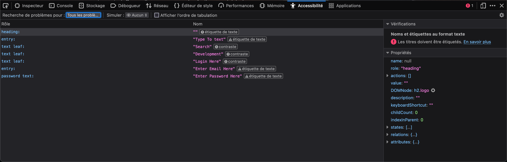
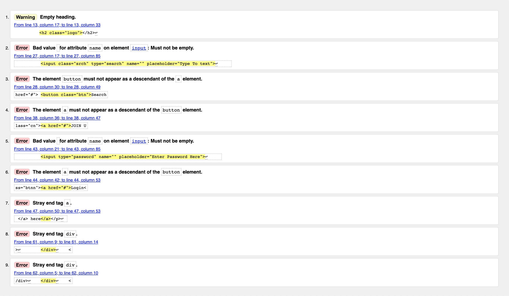

# **Refont web : développement** 🚀 


Dans le cadre de cette refonte, nous devons corriger les erreurs qui se sont glissées dans le projet, le HTML et la CSS.

### Première étape corriger les erreurs et l'organisation au sein des fichiers du projet.
- Nous pouvons remarquer que l'image **cover** qui sert d'image de présentation pour le readme ne se trouve pas dans le dossier **asset**. Pour une question d'organisation il faut que cette image soit placée dans le fichier **asset**. Après avoir déplacé le fichier cover dans le bon dossier il faut modifié les chemins dans lequel était appelé l'image. 

- Nous pouvons aussi voir que les packages **Javascript** nécessaire a la compilation, ne sont pas présent dans le dossier. Le dossier **src** également est absent ainsi que le fichier **app.js** qui permets d'injecter du JS dans le projet. De ce fait toutes les modifications apportées aux JavaScript ne seront pas compilés. Il faut créer le dossier src et le fichier app.js ensuite il faut installer et lancer le compileur dans le projet afin d'avoir les **packages.json** et **node_modules**.

- Le **site.webmanifest** n'est pas configuré et n'est pas lié au HTML. Par conséquent les icons ne seront pas prise en compte par le navigateur. Il faut donc formater le Json qui se trouve dans le fichier afin de le configurer correctement et ensuite l'ajouter dans le **head** du HTML.
```HTML
<head>
    <link rel="manifest" href="favicon/site.webmanifest">
</head>
```

### Deuxième étape vérifier les erreurs dans la console navigateur lors de l'inspection de la page web.

Nous allons vérifier en particulier l'onglet accessibilité afin de voir si les bonnes pratiques liées a l'accessibilité sont respectées.

Capture d'écran du rapport d'erreur dans l'onglet accessibilité :


Nous allons passer en revu chacun des erreurs remontés dans la console.

- **heading / entry / password text : étiquette de texte**
Cela signifie que les balises de titre ```<h1> <h2> <h3>``` etc... sont utilisées incorrectement ou hors de leur contexte. Les titres devraient être utilisés pour structurer hiérarchiquement le contenu de la page, et ils doivent être étiquetés correctement en tant que titres. Ls titres ne sont pas accompagnés d'étiquettes descriptives appropriées. Dans notre cas les erreurs **entry** et **password text** sont liées au fait que les champ de formulaire sont sans étiquette appropriée et ne comporte pas de label.
Concernant l'erreur du **heading** celle-ci est surement liée au fait que les balises de titre ne sont pas utilisées de manière hiérarchique.

- **texte leaf : contraste**
Cette erreur signifie que le contraste de couleur n'est pas optimal pour l'accessibiité. Elles ne sont pas conforme aux normes WCAG pour l'accessiblité des textes.

### Troisème étape nous allons corriger les erreurs dans le code HTML.

Lors d'une première lecture du code HTML, on s'apperçoit que la balise lang est a "en", il faut la modifier en "fr" afin que notre site soit référencé correctement en France et que les outils d'assitance puissent fournir la prononciation et le formatage appropriés pour le texte. Cette balise est un élément important pour indiquer la langue principale de la page web, ce qui contribue à améliorer l'accessibilité, la recherche, le traitement du texte et la compatibilité internationale de notre site.

```html
<html lang="fr">
```
Ensuite, nous pouvons voir que le head est incomplet il manque énormement de balises.


Pour se faire nous allons passer le code HTML au W3C afin de connaître les erreurs rencontrées.


#### Erreur #1
```From line 13, column 17; to line 13, column 33```


